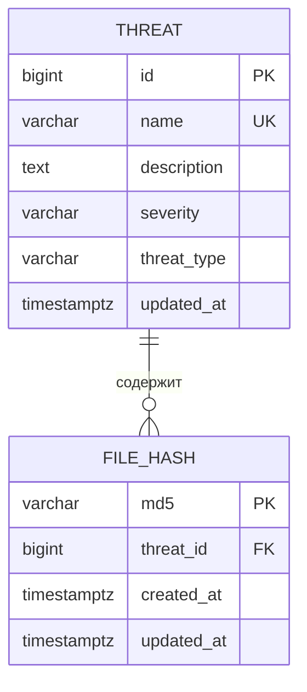

# ER-диаграмма

Одно название угрозы может соответствовать нескольким файлам с разными MD5.

```mermaid
erDiagram
    THREAT ||--o{ FILE_HASH : "содержит"
    THREAT {
        bigint id PK
        varchar name UK
        text description
        varchar severity
        varchar threat_type
        timestamptz updated_at
    }
    FILE_HASH {
        varchar md5 PK
        bigint threat_id FK
        timestamptz created_at
        timestamptz updated_at
    }
```

Детали полей и ограничений описаны в [relations.md](relations.md).
